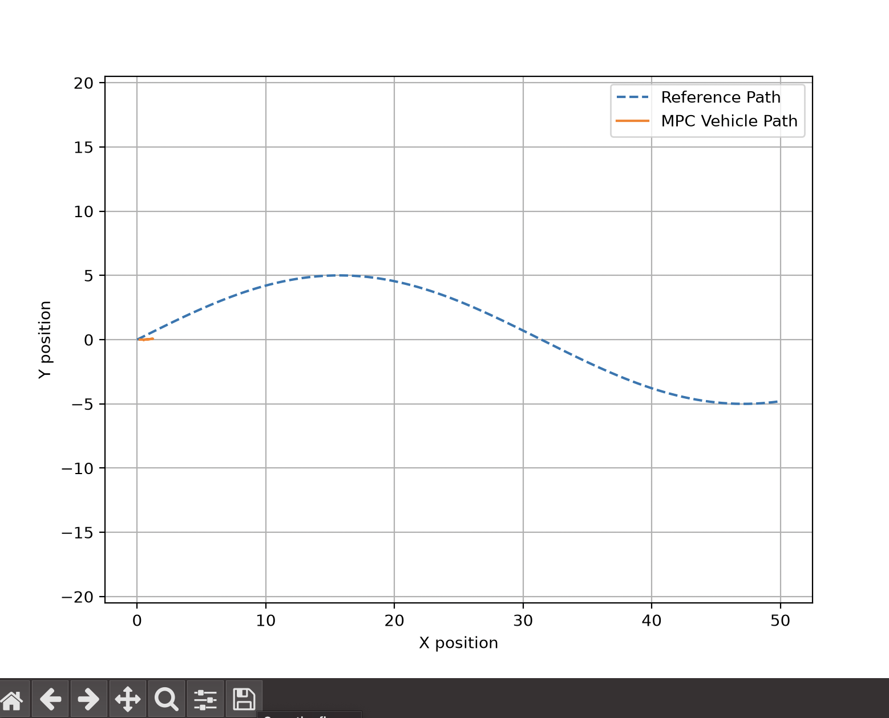
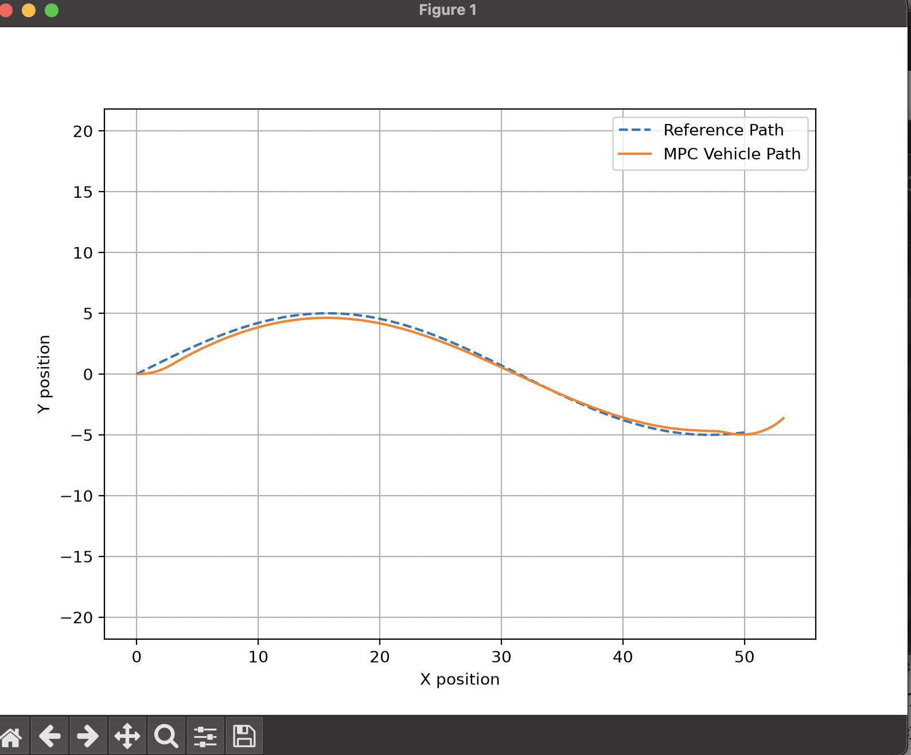
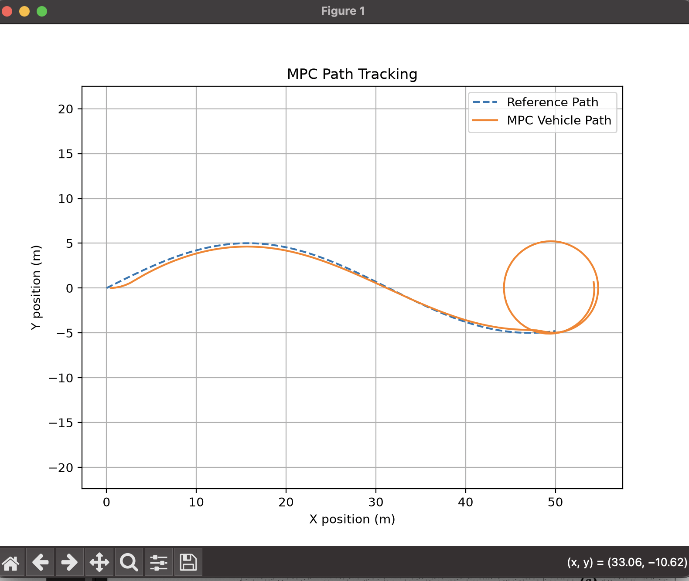

# MPC Debugging: Vehicle Not Moving

## Problem: I ran into a problem where the vehicle was not actually following the reference path-

The MPC vehicle trajectory was very small and stayed near the starting point instead of following the reference path.

## Cause

The controller was using the closest path point as the reference target.

At the starting position:

- Vehicle position = path position
- Tracking error ≈ 0

The optimizer minimized cost by keeping the vehicle stationary.

## Changes Made

### 1. Added Look-Ahead Target Point

Changed the path reference from the closest point to a point ahead on the path.
- Before: Vehicle → Closest Path Point
- After: Vehicle → Future Target Point
This gave MPC a direction to move toward.

### 2. Added Velocity Tracking Cost

Added a velocity objective to encourage the vehicle to maintain a desired speed.
MPC now minimizes:

- Path tracking error
- Steering effort
- Acceleration effort
- Velocity error

### 3. Increased Simulation Time
Increased simulation steps so the vehicle has enough time to follow the path.

## Result
The MPC controller now receives a meaningful future target and can generate control actions to follow the reference trajectory.

# -------------------------------------------------------------------------------------------------------------------------------
# MPC Debugging: End Point Overshoot

## Problem
Vehicle followed the path but created a circular trajectory near the endpoint.

## Cause
The MPC controller continued maintaining velocity after reaching the end of the reference path.
The optimizer had no stopping objective.

## Solution

- Reduced simulation duration
- Removed velocity tracking cost temporarily
- Added endpoint behavior consideration

## Lesson

MPC behavior depends strongly on:
- cost function weights
- reference trajectory
- constraints